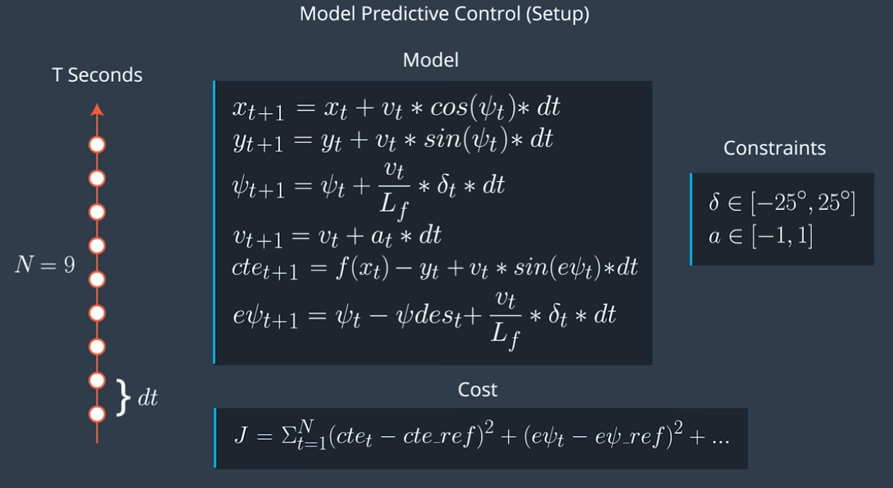

# MPC for Autonomous Vehicle Control in Simplified Environment

## Introduction

Model Predictive Control is an optimization problem to solve the needs of following a trajectory. The solution to this optimization problem suggests the optimal path in which an autonomous vehicle can follow. The MPC involves simulating different actuator inputs and predicting the trajectory with the minimum cost.

---
## Summarized Control Idealogy

- At each timestep, we must update the actuator inputs to always have the most optimized trajectory. 
- Once the lowest cost trajectory is found, execute the actuation commands.
- At each timestep, we update to find a new optimal trajectory. In this way, we calculate inputs over a future horizon.
- Updating the model will provide the most accurate estimation of the required actuations over time.

---
## Cost Function

**Minimize**:

1. State:
- Offset from the center of the lane (reference, or desired, state)
- Deviation from reference velocity
- Distance from the target location

2. Control Input:
- Minimize extreme sharp turning of the wheel (magnitude and rate of change)
- Etc

---
## More Technicalities

The prediction horizon is the duration over which future predictions are made. We’ll refer to this as T. T is the product of two other variables, N and dt.
a

N is the number of timesteps in the horizon. dt is how much time elapses between actuations. For example, if N were 20 and dt were 0.5, then T would be 10 seconds.

N, dt, and T are hyperparameters you will need to tune for each model predictive controller you build. However, there are some general guidelines. T should be as large as possible, while dt should be as small as possible.

In the case of driving a car, T should be a few seconds, at most. Beyond that horizon, the environment will change enough that it won't make sense to predict any further into the future.

***The goal of Model Predictive Control is to optimize the control inputs: [δ,a] .*** An optimizer will tune these inputs until a low cost vector of control inputs is found. The length of this vector is determined by N: 

Thus N determines the number of variables optimized by the MPC. This is also the major driver of computational cost.

MPC attempts to approximate a continuous reference trajectory by means of discrete paths between actuations. Larger values of dt result in less frequent actuations, which makes it harder to accurately approximate a continuous reference trajectory. This is sometimes called "discretization error".

The blue line is the reference trajectory and the red line the trajectory computed by Model Predictive Control. In this example the horizon has 7 steps, N, and the space in between white pebbles signifies the time elapsed, dt.

A good approach to setting N, dt, and T is to first determine a reasonable range for T and then tune dt and N appropriately, keeping the effect of each in mind.

Source: Udacity

---
## Model Predictive Controller Algorithm

Model Predictive Control uses an optimizer to find the control inputs that minimizes the cost function. The first set of control inputs are only executed before reaching a new state. The process is repeated.

### Setup

- Define Trajectory parameters T by choosing N and dt
- Define vehicle model and constrains as actual limitiations.
- Define cost functions

### Optimization Solver

- Use initial state, model constraints and cost function to return a vector of control inputs that minimize the cost function.

Steps:

1. Set N and dt.
2. Fit the polynomial to the waypoints.
3. Calculate initial cross track error and orientation error values.
4. Define the components of the cost function (state, actuators, etc).
5. Define the model constraints. These are the state update equations defined in the Vehicle Models module.

---
## Latency
In a real car, an actuation command won't execute instantly - there will be a delay as the command propagates through the system. A realistic delay might be on the order of 100 milliseconds.

This is a problem called "latency", and it's a difficult challenge for some controllers - like a PID controller - to overcome. But a Model Predictive Controller can adapt quite well because we can model this latency in the system. The PID controller could try to compute a control input based on a future error, but without a vehicle model it's unlikely this will be accurate.

A contributing factor to latency is actuator dynamics. For example the time elapsed between when you command a steering angle to when that angle is actually achieved. This could easily be modeled by a simple dynamic system and incorporated into the vehicle model. One approach would be running a simulation using the vehicle model starting from the current state for the duration of the latency. The resulting state from the simulation is the new initial state for MPC.

Thus, MPC can deal with latency much more effectively, by explicitly taking it into account, than a PID controller.

---
## Libraries Used

***Ipopt***

Ipopt is the tool we'll be using to optimize the control inputs. It's able to find locally optimal values (non-linear problem!) while keeping the constraints set directly to the actuators and the constraints defined by the vehicle model. Ipopt requires we give it the jacobians and hessians directly - it does not compute them for us. Hence, we need to either manually compute them or have a library do this for us. Luckily, there is a library called CppAD which does exactly this.

Souce: 

***CppAD***

CppAD is a library we'll use for automatic differentiation. By using CppAD we don't have to manually compute derivatives, which is tedious and prone to error.

In order to use CppAD effectively, we have to use its types instead of regular double or std::vector types.

Source: [CppAD](https://github.com/coin-or/CppAD)
 
