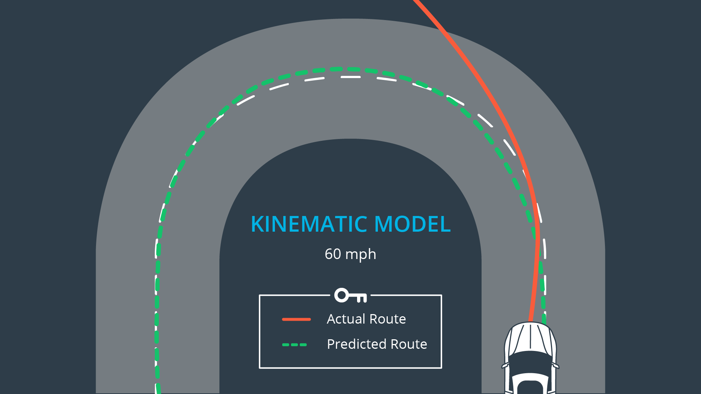
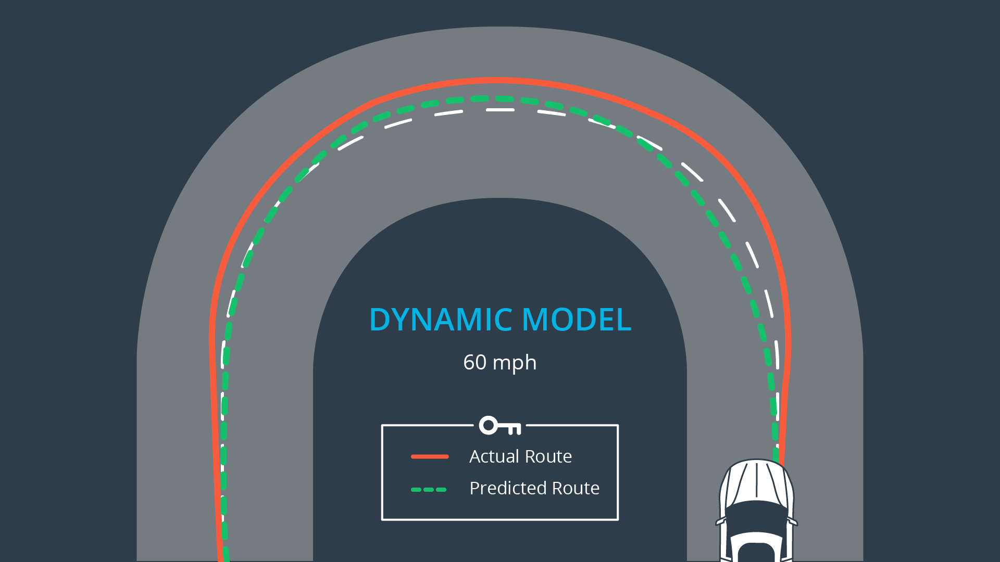
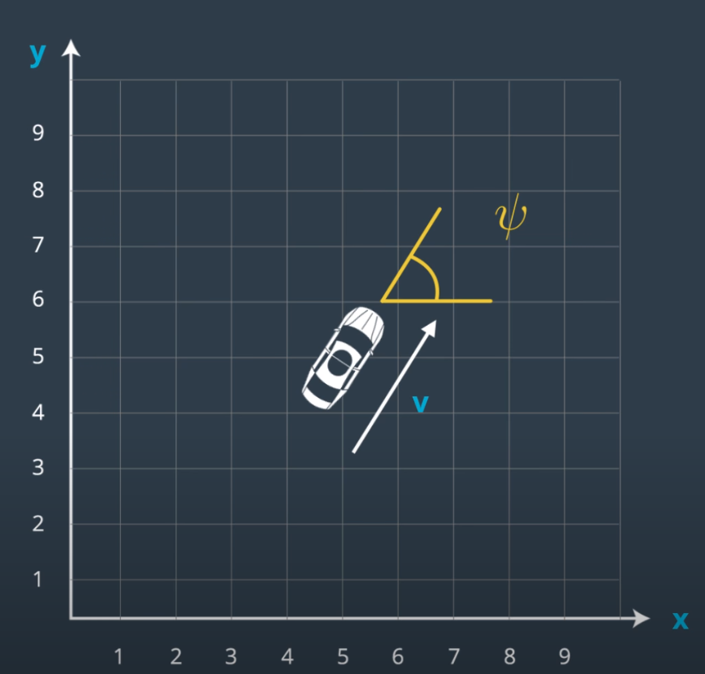
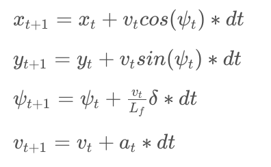
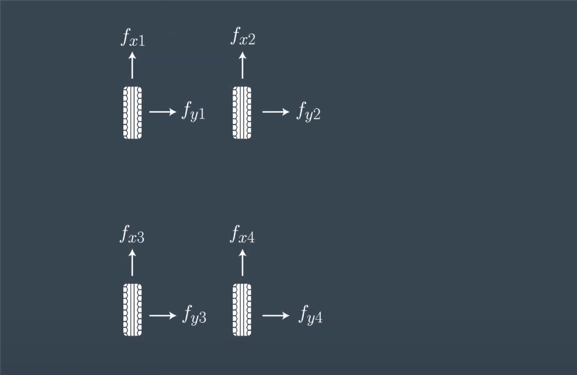
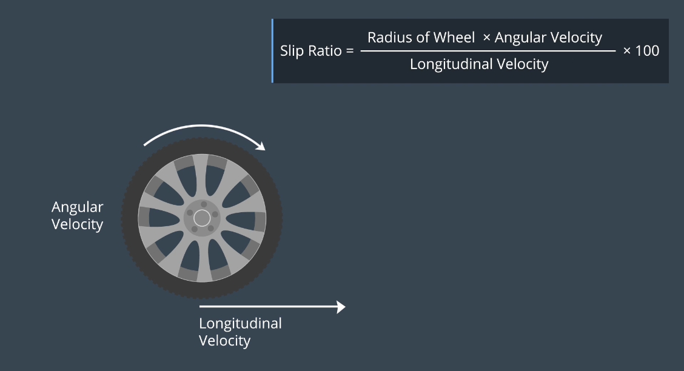
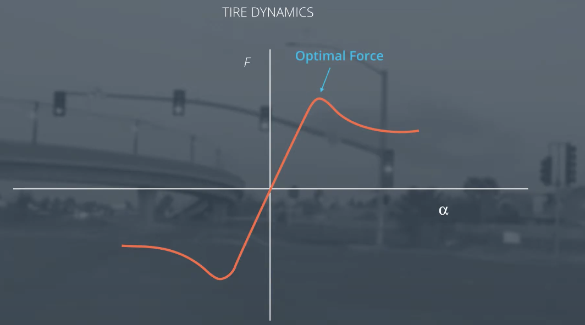

# Vehicle Dynamics

## Intro

- One approach to writing a good controller is to first model the vehicle's dynamics and constraints. It is important to understand how the vehicle works and this allows use to analyze and tune the controller more efficiently. A trade-off exists where more realistic models are more complex and challenging to work with. 

- An example of a vehicle model is the kinematic model. They are very simple to work and perform well. On the otherhand, the kinematic models ignore many elements like gravity and tire forces. Dynamic models captures more realistic forces.

--- 
## Vehicle Models

### 1. Kinematic Models

- Simplification of dynamic model that ignore forces, gravity and mass.

- This simplification reduces the accuracy of the models, but it also makes them more tractable.

- At low and moderate speeds, kinematic models often approximate the actual vehicle dynamics.

### 2. Dynamic Models

- Dynamic models aim to embody the actual vehicle dynamics as closely as possible.

- They might encompass tire forces, longitudinal and lateral forces, inertia, gravity, air resistance, drag, mass, and the geometry of the vehicle.

- Not all dynamic models are created equal! Some may consider more of these factors than others.

- Advanced dynamic models even take internal vehicle forces into account - for example, how responsive the chassis suspension is.

# State

- The simplest way to model a vehicle is to measure from a reference point the:

[ x-positon (x) , y-positon (y), heading (ψ), velocity (v) ]

- Now there is a need for equations to determine the next state (state at t+1) from our state vector at timestep, t, and our actuator values. Note that we’ve added a variable to our state called Lf. 

​
- Lf measures the distance between the front of the vehicle and its center of gravity. The larger the vehicle , the slower the turn rate.

- Below are the equation to model the Global Kinematic Model

- [x,y,ψ,v] is the state of the vehicle, Lf
​ is a physical characteristic of the vehicle, and [δ,a] are the actuators, or control inputs, to our system.

## Following Trajectories

Recall a possible AV Stack:

1. Perception: Locate surrounding environment including landmarks, vehicles, and pedistrians.
   
2. Localization: Compares model to map to figure out where the vehicle is.

3. Path Planning: Plots a trajectory using environmental model, map and vehicle location. 

4. Control: Follows trajectories

Typically, the path planning block passes the reference trajectory to the control block as a third/four degree polynomial. This order of polynomials typically can fit a trajectory that an automobile can take.

## Errors

A controller actuates the vehicle to follow the reference trajectory within a set of design requirements. One important requirement is to minimize the area between the reference trajectory and the actual trajectory. How? Minimize this error by predicting the vehicle's actual path and then adjusting the control inputs to minimize the difference between the two. That's how to use a kinematic model to preduct the vehicle's future state. Next, define the predicted error between the trajectory and that predicted path of the vehicle. Once the error is calculated, the actuators are used to minimize the error over time.

- What we are minimizing: distance of vehicle from trajectory, difference between vehicle orientation and trajectory orientation.

- We can capture how the errors we are interested in change over time by deriving our kinematic model around these errors as our new state vector.

- The new state is [x,y,ψ,v,cte,eψ]

### 1. Cross Track Error

Let’s assume the vehicle is traveling down a straight road and the longitudinal direction is the same as the x-axis.

- We can express the error between the center of the road and the vehicle's position as the cross track error (CTE). The CTE of the successor state after time t is the state at t + 1, and is defined as:

cte{t+1} = cte{t} + v{t} * sin(eψ) * dt

- In this case cte{t} can be expressed as the difference between the line and the current vehicle position y. Assuming the reference line is a 1st order polynomial f, f(x{t}) is our reference line and our CTE at the current state is defined as:

cte{t} = f(x{t}) - y{t} , thus we can say:

cte{t+1} = f(x{t}) - y{t} + (v{t} * sin(eψ) * dt)

The following can be broken up into two parts:

1. f(x{t}) - y{t} - being current cross track error.
2. v{t} * sin(eψ) * dt - being the change in error caused by the vehicle's movement.

### 2. Orientation Error

Orientation Error is defined as:

eψ{t+1} = eψ{t} - ψdes{t} + ( (v{t} / Lf) * δ{t} * dt)

- The update rule is essentially the same as psi, ψ.

- eψ{t} is the desired orientation subtracted from the current orientation.

eψ{t} = ψ{t} - ψdes{t}

- We already know ψ{t} , since it is apart of our state. We don't yet know ψdes{t} (desired ψ) - all we have so far is a polynomial to follow. 
- ψdes{t} can be calculated as the [tangetial angle](https://en.wikipedia.org/wiki/Tangential_angle) of the polynomial f evaluated  at x{t}, arctan(f'(x{t})). f' is the derivative of the polynomial.

Revisit:

eψ{t+1} = eψ{t} - ψdes{t} + ( (v{t} / Lf) * δ{t} * dt)

The following can be broken up into two parts:

1. eψ{t} - ψdes{t} - being current orientation error.
2. (v{t} / Lf) * δ{t} * dt - being the change in error caused by the vehicle's movement.

## Dynamic Models

- Dynamic Models provide more comprehensive, but less practical vehicle representation using detailed elements. These elements which comprise them are rigorous and could be modules or courses unto themselves. Some of which include:

1. Dynamic Model Forces
2. Tire Slip Angle
3. Tire Slip Ratio
4. Tire Models

- Pros: More accurate
- Cons: Perform worse in real-time, reusable to vehicles w/ varying attributes like mass.

- High complexity models would need major re-adjustment to account for even small differences. Lower complexity models do not suffer from this constraint and so can be placed in a wider range of vehicles, with far less additional effort, and unpredictability.

### 1. Forces

- The complex interactions between the tires and the road determine the motion of the vehicle. Longitudinal Forces and Lateral Forces account for the behaviour in the x and y direction. This is simply a sum of the forces on the tires.

### 2. Slip Angle

- Slip angle can be interpreted as the angle between the wheel velocity vector and the wheel orientation. The large squeel in a parking lot is the result of this angle. This can be interpreted as:

α = arctan(wheel lateral velocity angle / wheel longitudinal velocity angle)

- The force generated by the slip angle is how the vehicle turns, or else inertia would carry it off the road. 
- Different tires have different characteristics though, racing tires generate much more force from the same slip and as conventional tires.

### 3. Slip Ratio

- The slip ratio comes up when there's a mismatch between the speed of the vehicle wheel and the expected longitudinal velocity. In addition to the tires rolling motion, there is also a slipping motion. 
- Similarly how the slip angle's required to generate lateral force, the slip ratio is required to generate longitudinal force.

slip ratio = ((radius of wheel x angular velocity)/ longitudinal velocity) * 100

### 4. Tire model

- Tire models aim to model the behavior of the tire as closely as possible. Lateral force looks something like this. Alpha is the slip angle and F is the lateral force. 

- Race car drivers have a fantastic mental model of this graph and can usually capture optimal longitudinal or later force for the situation. 
- The slip angle is just one component used to measure the lateral forces of tires. 
- Theres a breadth of literature dedicated to the study of dynamics. The Pacejka tire model, also known as the Magic Tire Formula.

### Additional Resources

- [Pacejka Tire Model](http://www.theoryinpracticeengineering.com/resources/tires/pacejka87.pdf)
- [Kinematic and Dynamic Vehicle Models for Autonomous Driving Control Design](https://github.com/philbort/udacity_self_driving_car/blob/master/Term2/Lab_Model_Predictive_Control/IV_KinematicMPC_jason.pdf)
- [A brief overview of essential topics in vehicle dynamics](http://www.springer.com/cda/content/document/cda_downloaddocument/9783658039776-c1.pdf?SGWID=0-0-45-1468312-p176308738)

## Actuator Constraints

- In a real vehicle, actuators are limited by design of the vehicle and fundemental physics. For example, a vehicle cant have a steering angle or 90 degrees. 
- It's impossible, thus it doesnt make sense to consider these types of inputs. 
- This constraint is called model nonholonomics because the vehicle cant move in arbitrary direcitions. It is limited by steering angle constraints.
- We can solve this by setting lower and upper bounds for the actuators. (E.g Steering angle - [-30 degrees , 30 degrees], Acceleration - [-1 (Full Brake),1 (Full Acceleration)])
- In actual practice, the upper and lower bounds should model the vehicle.

Source: Udacity